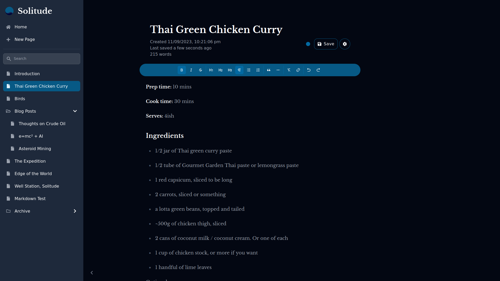

# Solitude

A minimalist web-app for focused writing and note-taking. Currently in early stages of development.



## Features
- Rich (but constrained) text editing
    - Headings, bold, italics, lists, links, blockquotes etc.
    - @mention other pages instead of manually create links.
- Autosaving with save status and 'last updated' indicators
- Search in sidebar
- Attractive UI including light and dark mode

Coming very soon:
- Tree structure for pages, similar to Notion
- Embedded images
- Offline support, including syncing
- Exporting of items as Markdown or HTML
- Manual toggling of light/dark mode.

## Uses
- [Next.js](https://nextjs.org/) runtime
- [Tiptap](https://www.tiptap.dev/) as editor backend
- [React](https://react.dev/)
- [TailwindCSS](https://tailwindcss.com/)
- [Prisma](https://www.prisma.io) for database queries

Currently, uses a SQLite database via Prisma, but this can be swapped out for any database that Prisma supports with minimal changes.

## Development

First, run the development server:

```bash
npm run dev
# or
yarn dev
# or
pnpm dev
```

Open [http://localhost:3000](http://localhost:3000) with your browser to see the result.

